# 🎬 AisMedia

Локальный медиасервер для просмотра фильмов, сериалов, аниме и мультфильмов прямо в браузере, без интернета.
Стек: Django + React (Vite) + TypeScript.

---

## 📖 Описание

AisMedia - это личный локальный медиасервер, который разворачивается на вашем компьютере или домашнем сервере.
Вы можете загружать и хранить фильмы, сериалы и аниме, а затем смотреть их из любого устройства в локальной сети (ПК, планшет, телефон) с удобным интерфейсом, адаптированным под мобильные экраны.

- Подходит для:

* Домашнего использования без зависимости от онлайн-сервисов
* Локального оффлайн-просмотра (например, в поездках)
* Организации своей коллекции медиа

---

## ✨ Особенности

- 📱 **Адаптивный дизайн** — оптимизирован под телефоны, планшеты и десктоп.
- 🗂 **Категории** — фильмы, аниме, мультфильмы, сериалы, прочее.
- 🎭 **Фильтрация по жанрам** и быстрый поиск.
- ⚡ **Мгновенная загрузка** — React + Vite + TypeScript.
- 🛠 **Работает локально** — доступен без интернета в одной сети.
- ⏳ **Skeleton-загрузчики** — плавная подгрузка контента.
- 🎬 **Поддержка серий и сезонов**.
- 🔑 **Авторизация и уровни доступа** (обычный пользователь, администратор).
- 📤 **Админ-панель** — загрузка фильмов, добавление серий, редактирование жанров и пользователей.
- 🎥 **Потоковое воспроизведение** через HTTP.
- 🔎 **Пойск фильма или сериала**

---

## 🛠 Технологический стек

**Frontend**

- React 18
- TypeScript
- Vite
- TailwindCSS (адаптивная верстка)
- DaisyUI (UI-компоненты)
- Axios (работа с API)

**Backend**

- Django
- Django REST Framework (DRF)
- JWT (djangorestframework-simplejwt) для аутентификации
- SQLite

**Прочее**

- Docker (опционально для деплоя)
- Nginx (опционально для проксирования)

**📂 Структура проекта**

AisMedia/
│
├── backend/ # Django проект (API)
│ ├── media/ # Модели и API для фильмов/жанров
│ ├── settings.py # Настройки Django
│ └── ...
│
├── frontend/ # React + Vite проект
│ ├── src/
│ │ ├── Components/ # Компоненты (MediaCard, SkeletonCard, etc.)
│ │ ├── Pages/ # Страницы (DefaultPage, ...)
│ │ ├── Interface/ # TypeScript типы
│ │ └── main.tsx
│ └── ...
│
└── README.md

---

> 📸 Скриншоты


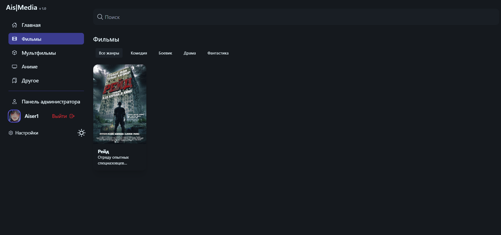
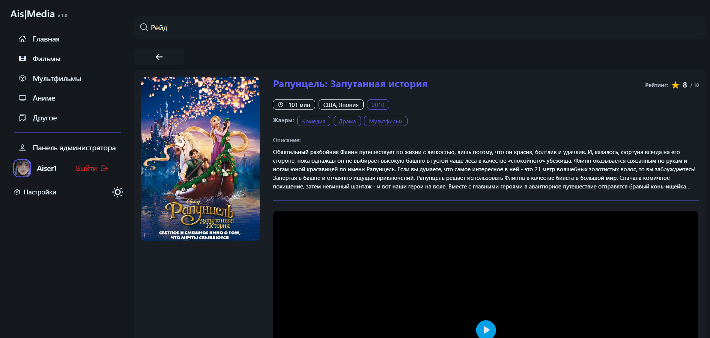
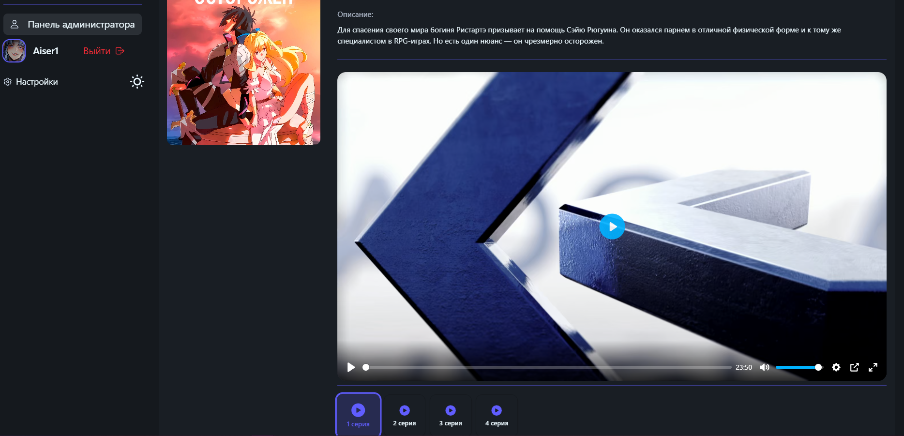
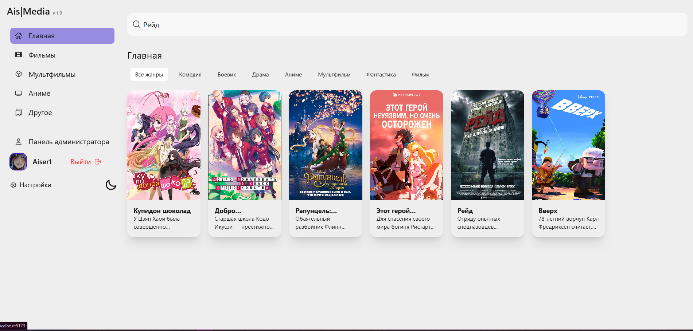
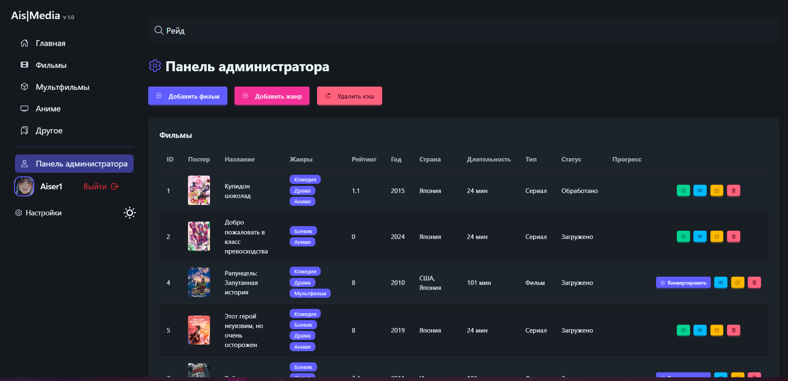
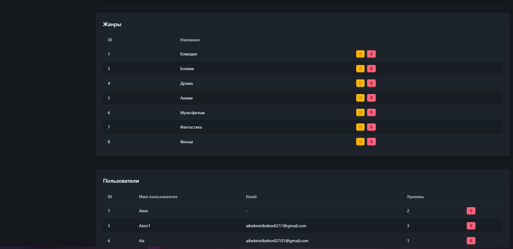
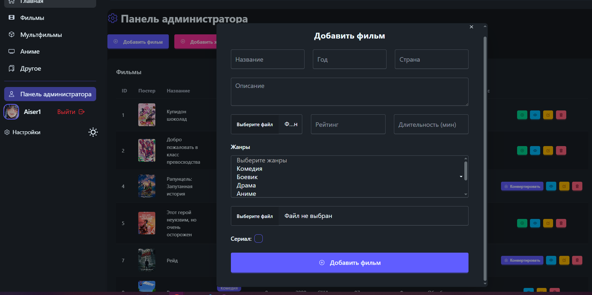
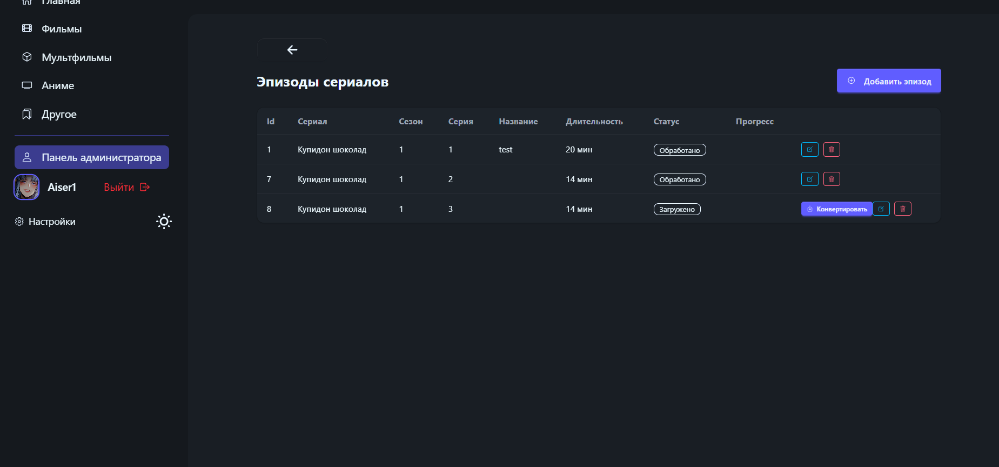
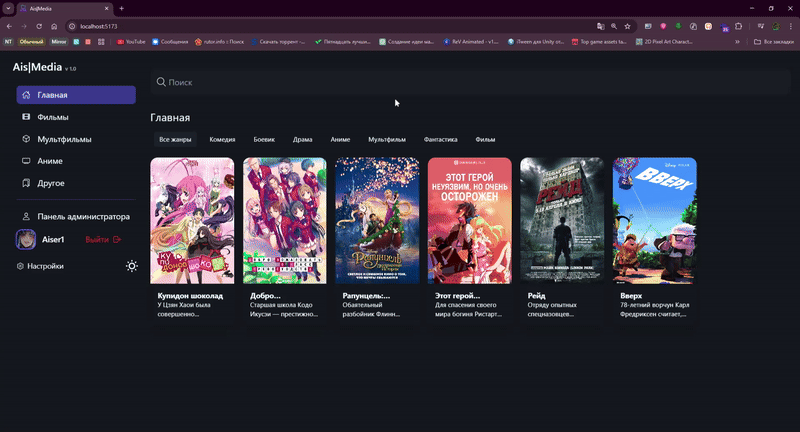
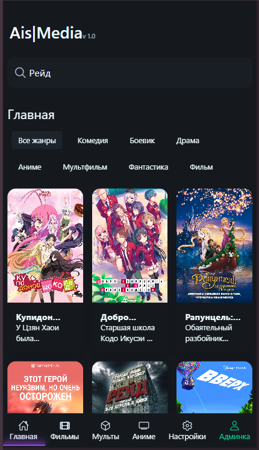
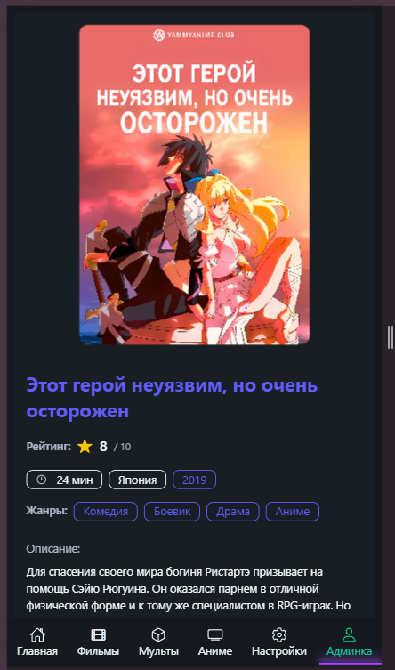
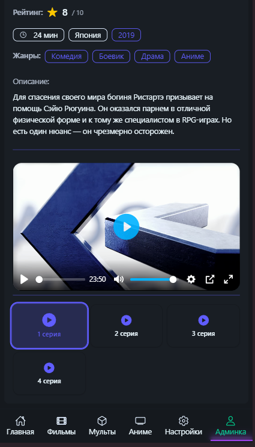
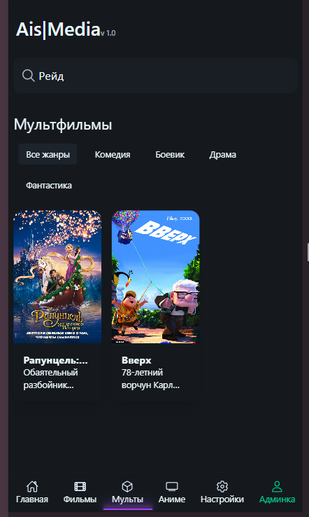

## ⚙️ Установка и запуск

### 1. Клонировать репозиторий

```bash
git clone https://github.com/username/aismedia.git
cd aismedia
```

## 2. Запуск backend (Django)

```bash
pip install -r requirements.txt
python manage.py migrate
python manage.py runserver 0.0.0.0:8000
```

## 3. Запуск frontend (Vite + React)

```bash
cd frontend
npm install
npm run dev
```

### 📜 Лицензия

Свободно для личного использования. Коммерческое использование запрещено без согласия автора.
